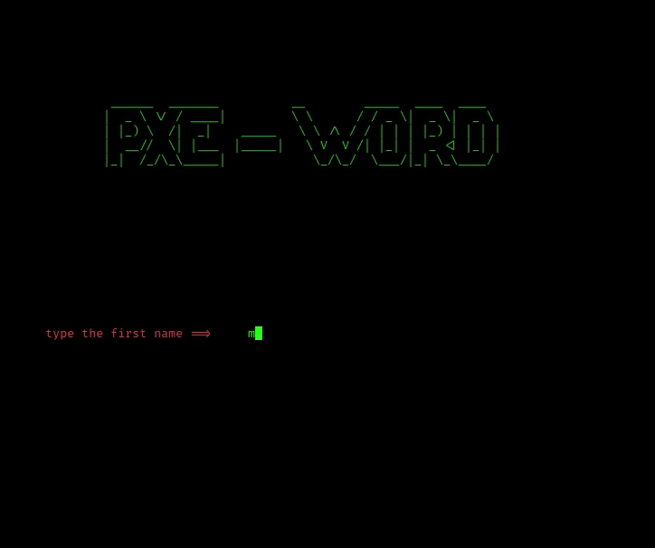

# x-word
The word x uses 
many modern algorithms
to create the best
word list and after 
completing the tool,
it checks the file
and deletes similar 
words - produces 
about one and a half
million passwords.
Enter the person’s
full name and date of
birth and browse a 
million passwords. The 
passes of the tool 
are peaceful reasons for
testing the password. 
Responsible here for 
any bad use of the tool
# Setup for linux

first you must install pip 

if you aleardy install pip you can skip this step

$$ sudo apt update

$$ sudo apt-get install python3 python3-pip

next :

$$  git clone https://github.com/MH-27/x-word.git

$$  cd x-word

$$  sudo pip3 install -r  requirements.txt

$$  sudo chmod +x x-word.py

$$  python3 x-word.py

# Contact
If you encounter any problem or want to inquire about something, do not hesitate to contact me

insta : www.instagram.com/al_ghonime

email : alghonime_27@outlook.com

